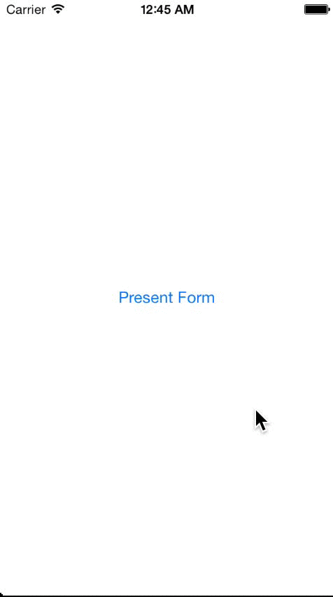

MAFormViewController
==================

MAFormViewController is designed to be used in tandem with MATextFieldCells for extremely quick and easy UITableView-based form creation that automatically handles form configuration, formatting, navigation, validation, and submission.


Usage
=====

Drop in the MAFormViewController.h/m, MAFormField.h/m, and MATextFieldCell.h/m into your project, and import MAFormViewController.h and MAFormField.h into whatever view controller you want to display the form from.

MAFormViewControllers are made up of arrays of MAFormField objects - which in a single line of code encapsulates lots of annoying code and logic that you won't need to write over and over again. The key is used later to identify the information the user entered for each field, the type (see below for more details) defines the type of form field that will be created, which includes keyboard types, data domain restrictions, an initial value in case you want to pre-propulate fields in the form with existing data, a placeholder for each field, a BOOL to tell the form whether or not you want to have the placeholders "animate" above the textfield so the users can see what they're editing after there's text present, and a BOOL used when we validate the form to ensure (or not) that field has an entry present.

Later you can group these MAFormField objects into arrays, representing a section of a form. A form can consist of any number of sections and fields. All you need to do is create all the fields, group them how you'd prefer, and pass them to the MAFormViewController's custom init method, which accepts the fields you created, a title for the button used to submit/send/save the form information, and a block that will pass back a dictionary representation of the form using the keys you provided when creating the fields as the keys in the dictionary, and the values the user entered into the fields as the values associated with those keys.

```js
MAFormField *nameField = [MAFormField fieldWithKey:@"name" type:MATextFieldTypeName initialValue:nil placeholder:@"Name" required:YES];
MAFormField *usernameField = [MAFormField fieldWithKey:@"username" type:MATextFieldTypeName initialValue:nil placeholder:@"Username" required:YES];
MAFormField *passwordField = [MAFormField fieldWithKey:@"password" type:MATextFieldTypePassword initialValue:nil placeholder:@"Password" required:YES];

// separate the cells into sections
NSArray *firstSection = @[nameField];
NSArray *secondSection = @[usernameField, passwordField];
NSArray *cellConfig = @[firstSection, secondSection];

// create the form and present it modally with its own navigation controller
MAFormViewController *formVC = [[MAFormViewController alloc] initWithCellConfigurations:cellConfig actionText:@"Save" animatePlaceholders:YES handler:^(NSDictionary *resultDictionary) {
    // now that we're done, dismiss the form
    [self dismissViewControllerAnimated:YES completion:nil];

    // if we don't have a result dictionary, the user cancelled, rather than submitted the form
    if (!resultDictionary) {
        return;
    }

    // do whatever you want with the results - you can access specific values from the dictionary using
    // the key you provided when you created the form
    [[[UIAlertView alloc] initWithTitle:nil message:[NSString stringWithFormat:@"Thanks for registering %@!", resultDictionary[@"name"]] delegate:nil cancelButtonTitle:@"Yay!" otherButtonTitles:nil] show];
}];

    // optional - disable the unsaved changes warning
    // formVC.warnForUnsavedChanges = NO;
    
    // optional - override the default unsaved changes message
    // formVC.unsavedChangesMessage = @"WAIT!!! You have unsaved changes!!";

UINavigationController *formNC = [[UINavigationController alloc] initWithRootViewController:formVC];
[self presentViewController:formNC animated:YES completion:nil];
```

Coupling the convenience and ease of MAFormViewControllers and MATextFieldCells, takes away the need for you to handle the most annoying and repetitive tasks associated with creating forms. All of the following is done automatically for you:

- Creating and configuring all of the textfields and table views
- Automatically bringing up the keyboard and setting focus on the first cell for quick editing.
- Setting the correct keyboard type for the data domain of the field.
- Setting the correct return key type (Next or Done) depending on if the field is the last in the form or not.
- Navigation from cell to cell using the keyboard so users don't need to tap on the next cell to continue filling out the form.
- Dismissing the keyboard when the last field is done being edited.
- Validation of required fields - ensuring they aren't left blank, telling users which fields are missing and setting the focus on the cell with the empty value.
- Warning users about unsaved changes before dismissing the form when they hit cancel.
- Packaging up all of the form data into a dictionary for ease-of-use.


With Animated Placeholders:
=====


Without Animated Placeholders:
=====




MATextFieldTypes and Standard Settings
=====

**Default**
- auto-capitalize new sentences
- auto-correction on
- default keyboard

**Name**
- auto-capitalize all words
- auto-correction off
- default keyboard

**Phone**
- number pad keyboard
- auto-formats text following format: (xxx) xxx-xxxx
- adds toolbar to keyboard for action button

**Email**
- auto-capitalize off
- auto-correction off
- email keyboard

**Address**
- auto-capitalize all words
- auto-correction on
- default keyboard

**StateAbbr**
- auto-capitalize all characters
- auto-correction off
- default keyboard
- 2 character limit

**ZIP**
- number pad keyboard
- 5 digit limit

**Number**
- number pad keyboard

**Decimal**
- decimal pad keyboard

**Date**
- number pad keyboard
- automatically formats entry to "MM/DD/YYYY" format

**Password**
- auto-capitalize off
- auto-correction off
- default keyboard
- secure text entry (characters are obfuscated)

**URL**
- auto-capitalize off
- auto-correction off
- URL keyboard

**NonEditable**
- disable the textfield - for display/informational purposes

MATextFieldActionTypes
=====

**None**
- does not create action bar/button, and uses default return key type for keyboard. Hitting 'return' on the keyboard does nothing.

**Next**
- if the field type requires a numeric keyboard and therefore has no 'return key', a toolbar is created and added as an input accessory view to the keyboard with "Next" as the title. You'll want to be sure you also implement the expected action (switch which textfield is the firstResponder) inside the actionBlock property as shown above.
- if the field type has a keyboard that includes a 'return key', the return key type is set to "Next". You'll want to be sure you also implement the expected action (switch which textfield is the firstResponder) inside the actionBlock property as shown above.

**Done**
- if the field type requires a numeric keyboard and therefore has no 'return key', a toolbar is created and added as an input accessory view to the keyboard with "Done" as the title. You'll want to be sure you also implement the expected action (resign the appropriate first responder) inside the actionBlock property as shown above.
- if the field type has a keyboard that includes a 'return key', the return key type is set to "Done". You'll want to be sure you also implement the expected action (resign the appropriate first responder) inside the actionBlock property as shown above.


Testing
=====

Open the project in Xcode, select the simulator and hit command-U.


Community
=====

Questions, comments, issues, and pull requests welcomed!! Thanks to Whelton for the Cocoapods integration, and thanks to jverdi's awesome project (https://github.com/jverdi/JVFloatLabeledTextField) for inspiration on the animated placeholders.

License
=====

This project is made available under the MIT license. See LICENSE.txt for details.


[](https://bitdeli.com/free "Bitdeli Badge")

